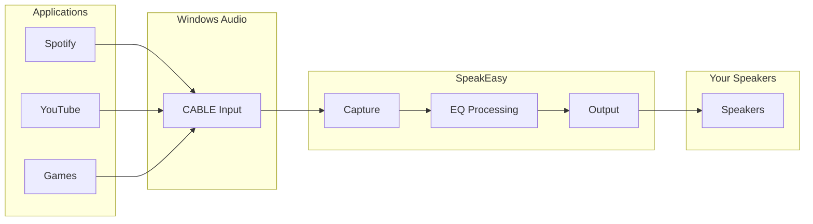

# SpeakEasy Bridge — System-Wide EQ

The SpeakEasy Bridge lets you use SpeakEasy as your system output device. Any app (Spotify, YouTube, games) can be directed to play through SpeakEasy, which applies your EQ and forwards the audio to your speakers.

## How It Works

1. **VB-Audio Virtual Cable** creates a virtual audio device pair:
   - **CABLE Input** — apps send audio here (select as system output)
   - **CABLE Output** — SpeakEasy captures from here

2. **SpeakEasy Bridge** captures from CABLE Output, applies your EQ curve, and plays to your real speakers.

## Setup

### 1. Install VB-Audio Virtual Cable

Download from [vb-audio.com/Cable](https://vb-audio.com/Cable/). Install and restart if prompted.

### 2. Set System Output

In Windows Sound settings (or the app's audio settings), set **Output** to **CABLE Input (VB-Audio Virtual Cable)**.

### 3. Start the Bridge

1. Run SpeakEasy (`npm install` then `run.bat` or `./run.sh`)
2. Open Play Music → **SpeakEasy Bridge** tab
3. Select **Input**: CABLE Output (or the virtual cable's capture device)
4. Select **Output**: Your speakers or headphones
5. Choose a speaker, preset, or genre for the EQ curve
6. Click **Start Bridge**

### 4. Play Audio

Any app using the system default output will now send audio through SpeakEasy. You'll hear it with your EQ applied.

## Requirements

- **Windows** (VB-Cable and naudiodon/PortAudio support)
- **Node.js** with `npm install` (naudiodon native addon)
- VB-Audio Virtual Cable installed

## API

The bridge is controlled via HTTP on the frontend server (port 8080):

| Method | Endpoint | Description |
|--------|----------|-------------|
| GET | `/bridge/devices` | List input and output devices |
| GET | `/bridge/status` | Bridge running state and current EQ |
| POST | `/bridge/start` | Start bridge. Body: `{ inputDeviceId, outputDeviceId, eqGains }` |
| POST | `/bridge/stop` | Stop bridge |

## Troubleshooting

- **Bridge API unavailable** — Run `npm install` and restart. Ensure naudiodon built successfully.
- **No audio** — Verify system output is set to CABLE Input. Check that the correct input device (CABLE Output) is selected.
- **Crackling or latency** — Try a different buffer size or sample rate in the bridge (advanced).
