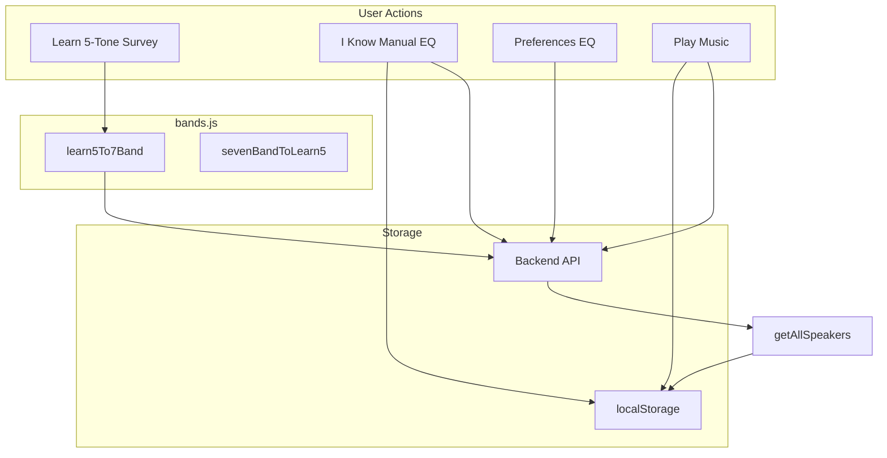

# SpeakEasy Frontend — Design System & Reference

A comprehensive, judge-oriented reference for the SpeakEasy frontend. This document explains every feature, design decision, and technical implementation at a level suitable for hackathon evaluators.

---

## Executive Summary

SpeakEasy's frontend is a vanilla HTML/CSS/JavaScript application that enables users to calibrate their speakers for consistent audio across devices. The architecture is **offline-first**: data lives in localStorage and syncs with a backend when available, ensuring full functionality even without network connectivity. Users choose between two calibration paths—**Learn** (guided 5-tone survey) or **Know** (manual 7-band EQ)—and the app applies real-time correction via the Web Audio API. A Three.js 3D speaker visualization on the landing page reinforces the product's audio focus. The tech stack deliberately avoids frameworks: no React, Vue, or Angular—just standard web APIs, Three.js for 3D, and the Web Audio API for DSP.

---

## Application Entry & Routing

### index.html

The application entry point. Uses both a meta refresh (`content="0; url=homePage.html"`) and a JavaScript redirect (`window.location.href = 'homePage.html'`) to ensure users always land on the main landing page, regardless of whether they navigate to the root URL or a bookmark. This provides a consistent first impression and avoids orphaned or empty index views.

---

## Design System

### Colors (`:root` variables)

| Variable | Hex | Use | Rationale |
|----------|-----|-----|-----------|
| `--light-green` | #a2faa3 | CTAs, accents, success states | High visibility for primary actions; conveys "go" and "success" |
| `--muted-teal` | #92c9b1 | Labels, secondary accents | Softer than primary green; suitable for supporting text |
| `--cerulean` | #4f759b | Speaker UI, technical elements | Distinguishes speaker-related UI from team/people content |
| `--grape` | #5d5179 | Team UI, people cards | Differentiates human/team content from hardware |
| `--deep-purple` | #571f4e | Header, footer | Strong brand anchor; creates depth in gradients |
| `--bg` | #0e0b14 | Background | Dark base for reduced eye strain and focus on content |
| `--surface` | #16101f | Cards, panels | Slightly lighter than bg for hierarchy |
| `--text` | #f0ede8 | Primary text | High contrast for readability |
| `--text-muted` | #a09ab0 | Secondary text | Lower emphasis for labels and hints |

### Typography

- **DM Serif Display** — Headings, logo. Serif typeface adds authority and brand personality; used sparingly for impact.
- **DM Sans** — Body text, buttons, navigation. Sans-serif for readability and modern feel; supports weights 300–600.
- **Space Mono** — Labels, technical UI, frequency values. Monospace reinforces precision and technical credibility.

### Global Styles

```css
*, *::before, *::after { box-sizing: border-box; margin: 0; padding: 0; }
body { background: var(--bg); color: var(--text); font-family: 'DM Sans'; overflow-x: hidden; }
```

### Noise Texture Overlay

A fixed SVG fractal noise overlay (`body::before`) adds subtle texture to the background without distracting from content. Opacity is kept low (~0.35) so it provides depth without visual noise.

### Component Catalog

| Component | Classes | Use | Accessibility Notes |
|-----------|---------|-----|---------------------|
| Primary CTA | `.btn-primary` | Solid light-green; main actions | High contrast; min-height 44px on mobile |
| Secondary | `.btn-outline` | Border only; secondary actions | Clear focus states |
| Stat card | `.stat-card` → `.stat-number`, `.stat-label` | Metrics display | Semantic structure for screen readers |
| Photo card | `.photo-card` → `.photo-placeholder` + `.card-info` | Speakers, team members | Hover states; keyboard navigable |
| Section label | `.section-label` | Eyebrow with line | Uppercase, letter-spacing for hierarchy |
| Waveform bars | `.wave-bars`, `.wave-bar` | Before/after visualization | Decorative; `aria-hidden` where appropriate |
| Tab | `.top-tab`, `.top-tab.active` | Panel switching | Active state; 44px touch targets |
| Slider | `input[type="range"]` | EQ bands, volume | Custom thumb; keyboard accessible |

---

## homePage.html — Landing & Marketing

### Header & Hero

A full-viewport gradient header establishes the product's value proposition. The topbar includes the SpeakEasy logo (DM Serif Display), tagline ("Speaker · Frequency · Balance"), and pill-style navigation to Home, Add Speaker, Preferences, and Play Music. The hero section presents the headline "Any Speaker *One Sound*" with supporting copy and two CTAs: **Add Your Speaker** (primary) and **Explore Your Preferences** (secondary). The active nav item uses `.active` styling (light-green background, deep-purple text).

### 3D Speaker Canvas (Three.js)

A procedurally built 3D speaker model occupies the header background. The model is constructed from:

- **Cabinet**: BoxGeometry with MeshStandardMaterial (roughness 0.45, metalness 0.35)
- **Woofer**: LatheGeometry cone, torus surround, dome cap; subtle "pump" animation driven by sine waves
- **Tweeter**: SphereGeometry dome with metallic cap and torus ring
- **Edge tubes and corner spheres**: CylinderGeometry and SphereGeometry for cabinet detailing

Lighting uses ambient light plus directional (key, fill, rim) and a point light for front glow. Colors align with the design system (muted-teal fill, light-green rim, cerulean front glow).

**Scroll-driven wave rings**: Twelve torus meshes spawn and animate based on scroll position and velocity. When the user scrolls, spawn rate increases, travel distance grows, and rings scale larger. Idle state uses slower, smaller waves. Opacity eases in and out. The speaker group has subtle rotation animation for life. The canvas is `aria-hidden="true"` for accessibility. Resize events update the renderer and camera aspect ratio.

### Mission Section

Explains the problem (speakers sound different) and solution (SpeakEasy flattens response). A **before/after waveform visualization** shows:

- **Before**: Two rows (Speaker A, Speaker B) with inconsistent bar heights (red `.wave-bars.inconsistent`)
- **Arrow badge**: "↓ SpeakEasy Applied ↓"
- **After**: Same speakers with uniform bar heights (green `.wave-bars.synced`)

Staggered CSS animations (`--spd` custom property) create a living visualization. Stat cards display: ±0.2 dB target tolerance, 20 Hz–20 kHz correction range, and 1000+ presets.

### Team Section

Photo cards for reference speakers and team members. Each card has a gradient placeholder (cerulean for speakers, grape for team), icon, name, role, and optional description. Hover states lift the card and add shadow. A subsection title ("Our Reference Speaker Array") separates speaker cards from team member cards.

---

## addSpeakerPage.html — Speaker Calibration Hub

### Tab Architecture

Three panels: **Learn My Speaker**, **I Know My Speaker**, **My Speakers**. Tab switching uses `.top-tab` and `.tab-panel` with fade-up animation. Device selection logic is shared across Learn and Know flows.

### Learn My Speaker (5-Tone Survey)

A guided wizard for users who want to calibrate by listening.

**Dual output device selection**: Users select separate outputs for "Computer" and "Speaker." This enables A/B comparison—e.g., laptop speakers vs. Bluetooth speaker—so they can hear the difference and rate relative loudness. A warning appears if both use the same device.

**6-step wizard**:
- **Steps 0–4**: Five frequency bands—60 Hz (sub-bass), 500 Hz (low midrange), 1 kHz (midrange), 3.5 kHz (upper midrange), 16 kHz (air/treble). Each step includes:
  - Frequency tag and educational copy (what the band represents)
  - "Play on Computer" and "Play on Speaker" buttons
  - Slider (0–100): "Computer louder" ↔ "Speaker louder"; 50 = even
  - Issue dropdown: crackle, feedback, muffled, rattle, harsh, sibilance, etc.
- **Step 5**: Review summary and "Add Speaker" confirmation

Progress bar and dot indicators show completion. `learn5To7Band()` converts the five readings (plus issues) into 7-band storage. The backend receives calibration via `speakerSystemsCalibrate` or `speakerSystemsCalibrateReplace`. On success, a **Speaker Added** confirmation page shows the frequency profile summary and links to View All Speakers or Add Another.

### I Know My Speaker (Manual EQ)

For users who already know their speaker's frequency response.

**Output device selector**: Choose the speaker being configured.

**Speaker Response sliders**: Seven bands (60, 170, 350, 1000, 3500, 8000, 16000 Hz). The user enters how the speaker *colors* sound—positive = boost, negative = cut. This describes the speaker's coloration.

**Correction EQ**: Auto-generated inverse (read-only). If the speaker boosts 8 kHz by +2 dB, the correction cuts 8 kHz by -2 dB, flattening the speaker so personal EQ sits on a neutral base.

**Naming & saving**: Name input plus "Save Preset" stores the speaker in localStorage and/or backend via `eqPresetsSave`.

**Test Music**: Drag-drop or click upload zone; inline audio player to audition the correction in real time.

### My Speakers

List of all calibrated speakers (Learn + Know sources merged via `API.getAllSpeakers()`). Each card shows name, metadata, and Edit/Delete actions. Edit opens a full Know-style form: rename, Speaker Response sliders (editable), Correction EQ (read-only), test player. `sevenBandToLearn5()` maps 7-band data back to 5-step UI when editing Learn speakers. Delete removes the speaker with confirmation. Empty state prompts "Add Your First Speaker."

---

## preferencesPage.html — Personal EQ & Presets

### Layout

Two-column grid: left = EQ + presets, right = test player. Stacks vertically on viewports under 900px.

### Active Speaker Selector

Dropdown populated from `API.getAllSpeakers()`. A badge shows the current selection with a pulsing dot. Switching speakers loads that speaker's calibration as the baseline; personal EQ is applied *on top* of it.

### Frequency Preferences (7-Band EQ)

Five bands displayed for preferences (60, 500, 1000, 3500, 8000 Hz); storage uses `BANDS_7` from bands.js. Each band has:
- Label and description
- Range slider ±16 dB with zero-line indicator
- Value display (green for positive, red for negative)

"Reset to Flat" restores all bands to 0 dB. Changes apply in real time via Web Audio API BiquadFilterNode when the test player is active.

### Saved Presets

List of named presets; click to load. Input + "Save" persists the current EQ curve to backend (`eqPresetsSave`) or localStorage. Presets can be speaker-linked or standalone. Delete removes presets via `eqPresetsDelete`.

### Test Your Sound

Drag-drop or click upload zone for audio files. Visualizer bars animate during playback. Play/pause, progress bar with seek, current/duration time. Spotify integration teaser ("Coming soon") indicates future streaming support.

---

## playMusic.html — Playback & Multi-Source EQ

### Three Tabs

**My Speakers**, **My Presets**, **Genre Presets**. Each tab has its own sidebar, player panel, and audio state.

### My Speakers

Sidebar lists all speakers from `API.getAllSpeakers()`. Selecting one loads its calibration as the active EQ. Output device selector routes audio system-wide via `AudioContext.setSinkId()`; a refresh button repopulates the device list (after `requestDeviceLabels()` for Chrome). Upload zone (drag-drop or click) loads an audio file. Playback controls: play, prev, next, seek bar, volume. EQ display shows vertical bars for the current correction curve.

### My Presets

Sidebar lists saved presets from Preferences (localStorage + API). Optional speaker selector: apply preset on top of speaker calibration, or EQ-only. Same upload/playback UI as My Speakers.

### Genre Presets

Predefined EQ curves: Pop, Rock, R&B, Jazz, Electronic. Each has a 10-band definition (32–16 kHz). `bandsTo10Band()` interpolates 7-band data to 10-band for playback. Genre cards show emoji, name, description; active state uses light-green border and background tint.

### Tab Capture

**Capture tab audio** applies the active EQ to audio from other browser tabs (Spotify Web Player, YouTube, etc.). Uses `getDisplayMedia({ video: true, audio: true })`; the user selects which tab to share. The captured stream is routed through `MediaStreamAudioSourceNode` → BiquadFilter chain → output. Video tracks are stopped immediately; only audio is processed. Capture stops when the user clicks Stop, switches panels, or ends sharing in the browser.

### Audio Pipeline

1. Decode audio file with `AudioContext.decodeAudioData()`
2. Create `AudioBufferSourceNode` from decoded buffer
3. Chain `BiquadFilterNode` per band (peaking EQ) with gains from calibration/preset
4. `GainNode` for volume
5. Connect to `AudioContext.destination` (or selected sink via `setSinkId`)

Seek: stop playback, update `pauseOffset`, restart from new position. Per-panel state tracks `audioCtx`, `sourceNode`, `gainNode`, `filters`, `decodedBuffer`, `isPlaying`, `startTime`, `pauseOffset`, `durationSec`, `volume`, and `activeEQ`.

### System-Wide EQ (EqualizerAPO Export)

**Why in-browser EQ only affects Brennan playback:** The Web Audio API processes only audio that flows through the browser tab. Spotify, YouTube, and other apps output directly to the system audio device and bypass the browser entirely. This is a fundamental browser sandbox constraint.

**Solution — EqualizerAPO export:** To apply the same EQ curve to Spotify, games, and all system audio on Windows, use the **Download config** or **Copy** buttons on Play Music or Preferences. This generates an EqualizerAPO config file.

**Setup:**
1. Install [EqualizerAPO](https://sourceforge.net/projects/equalizerapo/) (free, open-source, Windows only)
2. During setup, select your audio device
3. Export your EQ from SpeakEasy (Play Music or Preferences)
4. Save the downloaded `config.txt` to `C:\Program Files\EqualizerAPO\config\`
5. Restart EqualizerAPO or switch audio device to apply

**Caveats:** Works best with built-in sound cards; some USB/Bluetooth devices may not support APOs. Apps using ASIO or WASAPI exclusive mode bypass system effects.

---

## JavaScript Modules

### api.js

| Method | Purpose |
|--------|---------|
| `getAllSpeakers()` | Merges localStorage + backend; dedupes; includes Learn (readings) and Know (eqPresetKey) sources. Use for all speaker dropdowns. |
| `saveSpeakers(speakers)` | Persists speaker list to localStorage after add/edit/delete |
| `getActiveSpeaker()` / `setActiveSpeaker(id)` | Active speaker ID for preferences and playback |
| `getActiveSpeakerFromBackend()` | Fetches active speaker from API; falls back to localStorage |
| `check()` | Health check for backend availability |
| `speakerSystemsCreate(data)` | Create new speaker system |
| `speakerSystemsList()` | List speaker systems for user |
| `speakerSystemsCalibration(id)` | Get calibration readings for a speaker |
| `speakerSystemsCalibrate(id, readings)` | Submit calibration readings |
| `speakerSystemsCalibrateReplace(id, readings)` | Replace calibration entirely |
| `speakerSystemsUpdate(id, name)` | Rename speaker |
| `speakerSystemsSwitch(id)` | Set active speaker |
| `speakerSystemsDelete(id)` | Delete speaker |
| `eqPresetsList()` | List EQ presets |
| `eqPresetsSave(data)` | Save preset (name, bands, speaker link) |
| `eqPresetsDelete(id)` | Delete preset |
| `getAudioOutputDevices()` | Enumerate audiooutput devices via `navigator.mediaDevices.enumerateDevices()` |
| `requestDeviceLabels()` | Triggers getUserMedia to unlock device labels (Chrome) |
| `audioOptimize(...)` | POST `/audio/optimize` with samples, preferences, platform hint, speaker calibration |

### bands.js

| Constant / Function | Purpose |
|---------------------|---------|
| `BANDS_7` | [60, 170, 350, 1000, 3500, 8000, 16000] Hz — canonical 7-band definition |
| `BANDS_7_LABELS` | Human-readable labels for each band |
| `LEARN_5_HZ` | [60, 500, 1000, 3500, 3500] — Learn flow frequencies |
| `LEARN_5_LABELS` | Labels for 5 Learn steps |
| `LEARN_5_NAMES` | Descriptive names (Sub-bass, Low midrange, etc.) |
| `learn5To7Band(readings)` | Converts 5 slider values + issues → 7-band `{ bands, issues }` |
| `sevenBandToLearn5(bands, issues)` | Converts 7-band back to 5 readings for edit modal |
| `migrateLearnTo7Band(readings)` | Legacy: old 5-reading format → 7-band |
| `PLATFORM_OPTIONS` | Spotify, YouTube, Apple Music, Local — for source selector |

---

## Responsive Design & Accessibility

### Breakpoints

| Width | Changes |
|-------|---------|
| **768px** | Grids stack; photo grids `auto-fit minmax(140px, 1fr)`; section padding reduced; hero visual hidden |
| **480px** | Topbar/nav wrap; single column; touch targets 44px; footer stacks; stat cards single column |

### Touch Targets

- Nav links, buttons, tabs: `min-height: 44px` (WCAG 2.5.5)
- Edit/delete buttons: `min-width: 44px; min-height: 44px`

### Fluid Typography

- `.logo`: `clamp(1.6rem, 3vw, 2.2rem)`
- `.hero h1`: `clamp(3rem, 7vw, 6rem)`

### Accessibility

- `aria-hidden="true"` on decorative 3D canvas
- Focus management for tab panels and modals
- Semantic HTML (header, main, section, nav, footer)
- Sufficient color contrast for text and interactive elements

---

## Data Flow



---

## File Quick Reference

| File | Primary Purpose | Key Features |
|------|-----------------|--------------|
| `index.html` | Entry redirect | Meta + JS redirect to homePage.html |
| `homePage.html` | Landing, 3D scene | Three.js speaker model, scroll-driven wave rings, mission, team |
| `addSpeakerPage.html` | Calibration | Learn 5-tone survey, Know 7-band sliders, My Speakers CRUD |
| `preferencesPage.html` | Personal EQ | 7-band sliders, presets save/load, test player |
| `playMusic.html` | Playback | My Speakers, My Presets, Genre Presets tabs; device routing; BiquadFilterNode EQ |
| `js/api.js` | Backend + storage | CRUD, merge logic, device enumeration, audioOptimize |
| `js/bands.js` | EQ math | 5↔7 conversion, BANDS_7, LEARN_5 constants, PLATFORM_OPTIONS |
| `js/eqExport.js` | System-wide EQ | EqualizerAPO config export, download, clipboard copy |

---

## Elevator Pitch

> SpeakEasy flattens speaker frequency response so different speakers sound consistent. Users **Learn** (5 test tones) or **Know** (manual 7-band EQ) their speaker. The app applies correction in real time; users add personal EQ on a neutral base. Offline-first via localStorage + backend sync.

**For judges**: The frontend demonstrates technical depth through Web Audio API real-time DSP, Three.js procedural 3D, dual calibration paths (guided vs. expert), and offline-first architecture with graceful backend fallback.
